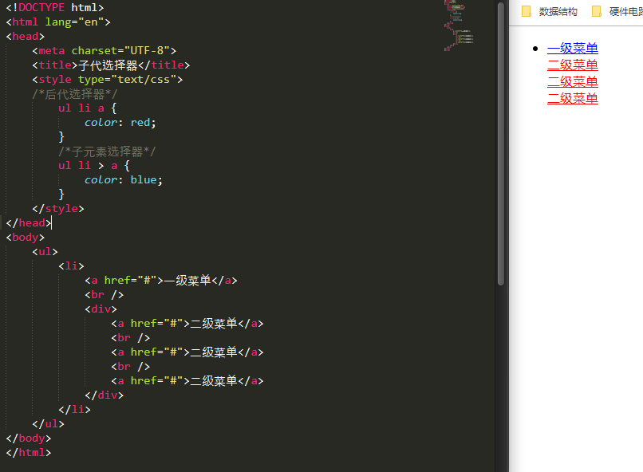

# 课程目标

>1. 学会使用CSS选择器
>2. 熟记CSS样式和外观属性
>3. 熟练掌握CSS各种选择器
>4. 熟练掌握CSS三种显示模式
>5. 熟练掌握CSS背景属性
>6. 熟练掌握CSS的三大特性
>7. 熟练掌握CSS盒子模型
>8. 熟练掌握CSS浮动
>9. 熟练掌握CSS定位
>10. 熟练掌握CSS高级技巧强化

# CSS 相关

CSS 的最大贡献是：让HTML从样式中解脱出来，实现了HTML专心去做结构呈现；CSS交给样式

CSS的样式做的非常出色，如果JavaScript是网页的魔法师，则CSS则是网页的美容师


# CSS样式表引入（书写位置）

## 内部样式表

书写位置：

```html
<!DOCTYPE html>
<html lang="en">
<head>
	<meta charset="UTF-8">
	<title>内部样式表</title>
	<style>
		h3 {
			color: skyblue;
			font-size: 50px;
		}
	</style>
</head>
<body>
	<h3>内部样式表</h3>
</body>
</html>
```

书写格式：

```html
<style>
	标签名称 {
		属性：值；
		属性：值；	
	}
</style>
```


## 行内式（内联样式）

书写位置：

```html
<h3 style="colcor:pinl; font-size:30px">
```


## 外部样式表（外链式）

书写位置：

```html
<!DOCTYPE html>
<html lang="en">
<head>
	<meta charset="UTF-8">
	<title>外部样式表</title>
	<link rel="stylesheet" type="text/css" href="style.css">
</head>
<body>
	<h3>外部样式表</h3>
</body>
</html>
```

书写格式：

```html
<head>
	<link href="CSS文件路径" rel="stylesheet" />
</head>
```

注意：

`link`是一个单标签！！！

link放在head头部标签中，并且指定link标签的三个属性，具体如下：

```
href:CSS文件的放置位置
rel：定义当前文档和被连接文档之间的关系，这里是'stylesheet'
type:定义所链接文档的类型，在这里指定为“text/CSS” 表示链接的外部文件为CSS样式表
```


## 三种样式表的总结


# CSS样式规则

CSS样式规则：


```
在上面的样式规则中：

1. 选择器用于指定CSS样式作用的HTML对象，{}为具体的属性和值
2. 属性和值是以键值对的形式出现的
3. 属性是指对象样式的属性
4. 属性和值之间使用英文符号的":"来进行连接
5.多个键值对之间使用“;”来进行连接
```

# 选择器

## 标签选择器

标签选择器是指使用HTML的标签名称做选择器，按照标签名称进行分类，其基本格式如下：

```
标签名 {属性：值；属性：值;}
元素名称{属性：值； 属性:值;}
```

- 优点：快速的为页面的中同一类型的标签统一样式
- 缺点：不能设计差异化

## 类选择器

类选择器使用"."进行标识，后面紧跟类名，其语法格式如下：

```
.类名{属性：值； 属性：值；}
```

类名的定义：

```
class="类名"
```

- 优点：为元素对象定义单独或者相同的样式，可以选择一个或者多个标签

小技巧：

```
1.长名称推荐使用中横线来为选择器命名
2.不建议使用_来命名CSS选择器
3.不要用纯数字、中文等命名，尽量使用英文字母来表示
```

例子：


```html
<!DOCTYPE html>
<html lang="en">
<head>
	<meta charset="UTF-8">
	<title>Google图标</title>
	<style type="text/css">
		span {
			font-size: 100px;
		}
		.G {
			color:skyblue;
		}
		.o {
			color: red;
		}
		.o2 {
			color: orange;
		}
		.l {
			color: green;
		}
		.e {
			color: red;
		}
	</style>
</head>
<body>
	<span class="G">G</span>
	<span class="o">o</span>
	<span class="o2">o</span>
	<span class="G">g</span>
	<span class="l">l</span>
	<span class="e">e</span>
</body>
</html>
```


## 多类选择器

我们可以给标签指定多个类名，从而达到更多选择的目的

注意：

```
1. 样式显示效果根HTML元素中类名的先后顺序没有关系，受CSS样式书写的上下顺序有关系
2. 各个类名中间使用空格间隔
```

```html
<div class="pink fontWeight font20"> 亚索 </div>
<!--多样式重叠-->
```


## id选择器

id选择器使用“#”来进行标识，后面紧跟id名称，其基本语法格式如下：

```
#id {属性：值；属性：值；}
```

该语法中，id名即为HTML元素的id值，大多数的HTML元素都可以定义id属性，元素的id值是唯一的

## 通配符选择器

通配符选择器使用“*”来表示，它是所有选择器中作用范围最广的，能匹配页面中所有元素，其基本语法格式如下：

```
* {属性1：值；属性2：值}
```

## id选择器 和类选择器之间的区分(还是不大明白？)

W3C规定，在同一个页面中，不允许有相同名字的id的对象出现，但是允许相同名字的calss出现

calss选择器比作名字，可以重名

id选择器比作人的身份证，全中国唯一，不得重复，只能使用一次


# CSS样式属性

## 字体连写

字体连写是有顺序的：

```
选择器 {font:font-style;font-weight;font-size; font-family;}
选择器 {font：xxx,xxx,xxx;}
```


## `font-size` 字体大小

font-size 用来设置自豪，该属性的值可以使用相对长度，也可以使用绝对长度

推荐使用像素操作


## `font-family` 字体

font-family属性用于设置字体。网页中的字体有宋体，微软雅黑‘黑体等

设置段落字体：

```html
<style>
P {font-family:"微软雅黑"；}
</style>
```

```
技巧：
1. 现在网页中普遍使用的14px+
2. 尽量使用偶数的数字字体，老浏览器支持奇数会有Bug
3. 各种字体必须使用英文状态下的逗号进行隔开
4. 中文字体添加英文状态下的引号，英文字体一般不需要添加引号。当设置英文字体时，英文字体在前面，中文字体在后面
5. 如果字体中包含 空格 $ # 等符号，则该字体必须添加引号.
font-family:"Times News Roman"
6. 尽量使用默认字体，保证在任何用户的浏览器中都可以正确显示
```


## `CSS Unicode `字体

在CSS中设置字体名称时，直接使用中文是可以的。但是文件编码不匹配时会产生乱码。XP系统不支持类似微软雅黑的中文

```
方案1：你可以使用英文来替代 font-family:"Microsoft Yahei"
方案2：在CSS中直接使用Unicode编码表 font-family:"\5FAE\8F6F\96C5\9ED1"
```

可以使用excape()来测试到底使用了什么字体

| 字体名称    | 英文名称        | Unicode 编码         |
| ----------- | --------------- | -------------------- |
| 宋体        | SimSun          | \5B8B\4F53           |
| 新宋体      | NSimSun         | \65B0\5B8B\4F53      |
| 黑体        | SimHei          | \9ED1\4F53           |
| 微软雅黑    | Microsoft YaHei | \5FAE\8F6F\96C5\9ED1 |
| 楷体_GB2312 | KaiTi_GB2312    | \6977\4F53_GB2312    |
| 隶书        | LiSu            | \96B6\4E66           |
| 幼园        | YouYuan         | \5E7C\5706           |
| 华文细黑    | STXihei         | \534E\6587\7EC6\9ED1 |
| 细明体      | MingLiU         | \7EC6\660E\4F53      |
| 新细明体    | PMingLiU        | \65B0\7EC6\660E\4F53 |

为了照顾不同电脑的字体安装问题，推荐使用宋体和微软雅黑

## `font-weight` 字体粗细

- 可使用HTML的标签 `<b> or <strong> `

- 可以使用CSS实现：

  ```css
  font-weight:normal/bold/bolder/lighter 100~900(100的整数倍)
  数字400 表示normal 
  数字 700 等价于bold
  ```

## `font-style` 字体风格

- 可使用HTML的标签`<i> or <em>`

- 可以使用CSS实现：

  ```CSS
  normal :正常字体
  italic:浏览器会显示斜体的字体字样
  oblique:浏览器会显示倾斜的字体样式
  
  平时，我们很少给字体添加斜体，反而喜欢使用斜体标签，改为普通模式
  ```

  

## `font` 综合设置字体样式

语法格式：

```CSS
选择器 {font: font-style font-weight font-size font-family;}
```

```
使用font属性是，必须按照上面的语法格式的顺序进行书写，不能更换顺序，各个属性以空格隔开
注意：其中不需要设置的字体可以省略。但是必须保留的是font-size 和 font-family
否则font则不起作用
```

# `CSS`的外观属性

## `color` 颜色

`color`用来 定于文本的颜色

- 预定义颜色
- 16进制颜色` #xxxx`
- RGB颜色` rgb(xxx,xxx,xxx)`

## `line-height` 行间距

设置行和行之间的距离

- `px`
- `em`
- `%`
- 一般情况下，行距比字号大7 或8个像素就可以了

## `text-align` 水平对齐方式

- `left`
- `right `
- `center`

## `text-indent` 首行缩进

- 建议使用em作为设置单位
- 1em就是一个字的宽度 如果是汉字，就是一个汉字的宽度

## `text-decoration`文本装饰

- `none `默认效果
- `underline` 下划线
- `overline` 上划线
- `line-though`中间画线

# 开发者工具

- Chrome的F12
- ctrl+滚轮 可以 放大开发者工具代码大小。
- 左边是HTML元素结构   右边是CSS样式。
- 右边CSS样式可以改动数值和颜色查看更改后效果。


# CSS 复合选择器

复合选择器由两个或者多个基础选择器组成，通过不同的方式组合而成的，目的是为了可以选择更精准的目标元素标签

## 交集选择器

交集选择器是由2个选择器组成：

- 标签选择器

- class选择器

  书写格式：

  ```CSS
  <style>
  	h3.class {属性:值;属性:值；}
  </style>
  ```

  

**记忆技巧**

```
交集选择器是并且的意思
p.one 类名是one的 段落标签
```

## 并集选择器

- 使用逗号隔开

- 多个选择器标签

  书写格式：

```css
<style>
	h3,p {属性:值; 属性:值;}
</style>
```


**记忆技巧**

```CSS
并集是指和的意思
.one,p,#id {color:#0000}
```

## 后代选择器

后代选择器又称之为包含选择器，用来选择元素或者元素组的后代

写法：

- 外层标签写在前面
- 内层标签写在后面
- 中间使用空格间隔
- 当标签发生嵌套时，内层标签就成了外层标签的后代


## 子元素选择器

子元素只能选择作为某子元素元素的元素

- 父极标签写在前面
- 子级标签写在后面
- 中间使用 > 进行连接
- `>` 两边要有空格


这里的子元素，只是包括子元素，不包括孙子，重孙子等

```
.demo > h3 {color:red;}
说明h3是demo的亲儿子，demo元素中包含着h3
```



## 链接伪类选择器

- `:link`:未访问的链接
- `visited`：以访问的链接
- `:hover`：鼠标移动到链接上
- `:active`：选定的链接

**记忆技巧：**

```
LV 包包 hao
```

```CSS
<style>
	a {font-color:red;}
a:hover {
    font-color : blue;
}
</style>
```


# CSS 的注释

```
使用/**/来进行注释
```

# Sublime快捷键

- 直接生成标签：`div -> tab -> <div> </div>`
- 生成多个标签：`div*n`
- 如果是有父子级别的标签使用 `ul>li` 无空格
- 如果是有兄弟关系的标签，使用 `div+p`
- 如果是生成带有类名或者id名字的标签，使用 `.demo`

```html
<!DOCTYPE html>
<html lang="en">
<head>
	<meta charset="UTF-8">
	<title>测试题</title>
	<style type="text/css">
		.site-r > a {
			color: red;
		}
		.nav a {
			font-family: "微软雅黑";
		}
		.nav > ul > li > ul > li > a {
			color: orange;
		}
	</style>
</head>
<body>
	<div class="nav">    <!-- 主导航栏 -->
	  	<ul>
		    <li><a href="#">公司首页</a></li>
			<li><a href="#">公司简介</a></li>
			<li><a href="#">公司产品</a></li>
			<li>
	         	<a href="#">联系我们</a>
			 	<ul>
			    	<li><a href="#">公司邮箱</a></li>
			    	<li><a href="#">公司电话</a></li>
			 	</ul>
			</li>
	  </ul>
	</div>
	<div class="sitenav">    <!-- 侧导航栏 -->
	  	<div class="site-l">
	  		左侧侧导航栏
	  	</div>
	  	<div class="site-r">
	  		<a href="#">登录</a>
	  	</div>
	</div>
</body>
</html>
```


# 标签显示元素

- 块标签 块元素
- 行内标签 行内元素

## 块级元素

- 每个块元素会独自占据一行或者多行
- 可以设置宽度 高度 对齐等属性 
- 通常用于网页布局和网页结构的搭建

常见的块元素：

```
<h1> ~ <h6> <p> <div> <ul> <li> 等 其中<div>标签时最典型的块元素
```

**块级元素布局的特点：**

- 总是从新行开始的
- 高度 宽度 外边距和内边距都可以控制
- 宽度默认是容器的100%
- 可以容纳内联元素和其它块元素

## 行内元素

- 不占据独有的区域
- 靠自身的字体大小和图像尺寸来支撑结构
- 一般不可以设置属性
- 常用于控制页面的中文本的样式

常见的行内元素有：

```
：<a> <strong> <b> <em> <i> <del> <ins> <u> <span>等
其中<span>标签时最典型的行内元素
```

**行内元素的特点：**

- 和相邻行内元素在一行上
- 高框无效，但是水平方向的`padding` `margin`可以设置,垂直方向无效
- 默认宽度就是他本身内容的宽度
- 行内元素只能容纳文本或者其他行内元素<a 特殊>

## 行内块元素

```
在行内元素中有几个特殊的标签： <input /> <td> 可以对他们设置狂傲和对齐属性
```

**行内块元素的特点：**

- 和相邻行内元素在一行上，但是之间会有空白空隙
- 默认宽度就是他本身内容的宽度
- 高度 行高 外边距 和内边距都可以控制


## 标签显示模式转化

- 块转行内 `display:inline`
- 行内转块 `display:block`
- 块、行内元素转换为行内块：`display:inline-block`

```html
<!DOCTYPE html>
<html lang="en">
<head>
	<meta charset="UTF-8">
	<title>显示模式转化</title>
	<style>
		div {
			width: 400px;
			height: 100px;
			background-color: red;
			display: inline;
		}
		span {
			width: 400px;
			height: 100px;
			background-color: blue;
			display: block;
		}
		input {
			width: 100px;
			height: 100px;
			background-color: green;
			display: inline-block;
		}
		a {
			width: 100px;
			height: 100px;
			background-color: green;
			display: inline-block;
		}
	</style>
</head>
<body>
	<div>块级元素</div>
	<div>块级元素</div>
	<div>块级元素</div>
	<br />
	<span>行内元素</span>
	<span>行内元素</span>
	<span>行内元素</span>
	<br />
	<input type="text" name="" id="">
	<input type="text" name="" id="">
	<input type="text" name="" id="">
	<br />
	<a href="#">行内块元素</a>
	<a href="#">行内块元素</a>
	<a href="#">行内块元素</a>
</body>
</html>
```


