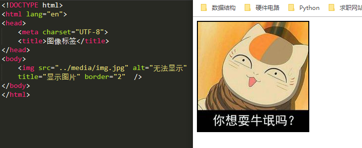
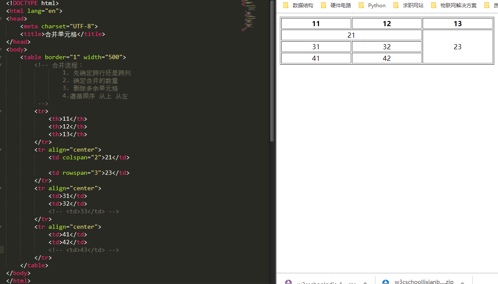

>学习目标：
>	- 了解常用浏览器  
>	- 掌握WEB标准  
>	- 理解语义化标签  
>	- 掌握常用的排版标签  
>	- 掌握常用的文本格式化图像链接等标签  
>	- 掌握三种列表标签  
>	- 掌握表格标签  
>	- 掌握表单标签


## 开发工具

- 开发环境：
  - 我们主要使用的开发工具为`Chrome` `sublime` ` photoshop`
  - PS的使用频率比较高，要求：熟练切图 和网站美工美眉有共同话题...
- 浏览器内核：

```
浏览器内核分为两部分：渲染引擎和JS引擎
    渲染引擎 负责取得网页内容（HTML XML 图像等）、整理讯息（加入CSS等）、以及计算网页的显示方式，然后会输出到显示器或者打印机。不同浏览器的内核对于网页的语法解释会有所不同，所以渲染效果不同。
JS引擎 则是进行解析 JavaScript语言，执行JavaScript语言来实现网页的动态效果。
```

1、Chromium/Blink(Chrom)

​       在 Chromium 项目中研发 Blink 渲染引擎（即浏览器核心），内置于 Chrome 浏览器之中。Blink 其实是 WebKit 的分支。 

​       大部分的国产浏览器都是基于Blink内核进行的二次开发。

2、webkit（safari）

Safari 是苹果公司开发的浏览器，所用浏览器内核的名称是大名鼎鼎的 WebKit。

​      现在很多人错误地把 webkit 叫做 chrome内核（即使 chrome内核已经是 blink 了），苹果感觉像被别人抢了媳妇，都哭晕再厕所里面了。

3、 Gecko（firefox）

​       Gecko(Firefox 内核)： Mozilla FireFox(火狐浏览器) 采用该内核，Gecko 的特点是代码完全公开，因此，其可开发程度很高，全世界的程序员都可以为其编写代码，增加功能。 可惜这几年已经没落了， 比如 打开速度慢、升级频繁、猪一样的队友flash、神一样的对手chrome。

## WEB标准

>网页主要有文字、图像和超链接等元素组成，当然除了这些元素，网页中还可以包含音频、视频以及Flash等

Web标准不是一个标注，而是W3C和其他标准化组织制定的一系列标准的集合。

主要包括三个方面：结构、表现、行为

```
结构标准：结构用于对网页元素进行整理，主要学习HTML
表现标准：表现用于设置网页元素的版色、颜色、大小等，主要是指CSS
行为标准：行为是指网页模型的定义和人机交互的编写，主要学习JavaScript
```


## HTML 初识

> 先学习HTML  再学习CSS

- HTML称之为超文本标签语言：
  - 超 是指可以加入各种素材，还可以进行超链接
  - 文本 是指可以进行文本写入
  - 标签 HTML是一个标签语言，而非编程语言

其总结为：HTML作用是用标记标签来描述网页，把网页内容在浏览器中展示出来

## HTML语言的格式

```html
<html>
	<head>
		<title> </title>
	</head>
	<body>
	</body>
</html>
```

```
1. HTML标签：作用于HTML标签的一个根节点，最大的标签 根标签
2. head标签：文档的头部 在head标签中必须设置的标签为title
3. title标签：文档的标题
4. body标签：文档的主体
```


## HTML的标签分类

- 双标签：

  `<标签名>内容 </标签名>`

  `/`称之为关闭符

- 单标签：

  ```html
  <br />
  <hr />
  
  <base />
  ```

  

  单标签也是标签，是指用一个标签符号即可完整的描述某个功能的标签

## HTML的标签关系

- 嵌套关系
  - 有一个tab键的缩进
- 并列关系
  - 平行

## 文档类型

```html
<!DOCTYPE html> <!--HTML5-->
<html lang="en">
	<head>
		<meta charset="UTF-8"> <!--字符集-->
		<title>Document</title>
	</head>
	
	<body>
		
	</body>
</html>
```

## HTML标签的语义化

>所谓标签语义化是指标签的含义

- 优点：
  - 方便代码的阅读和维护
  - 同时让浏览器或者网络爬虫很好的解析
  - 使用语义化标签会具有更好的搜索引擎优化

核心：合适的地方给一个最合理的标签

语义是否良好：当我们去掉CSS之后，网页结构依然组织有序，并且有良好的可读性

## HTML的常用标签

### 排版标签

#### 标题标签

`<h1> <h2> <h3> <h4> <h5> <h6>`

`<h1>title</h1>`

> h1标签尽量少用，一般h1都是给Logo使用或者网页中的最为重要的标题信息
>
> 标题标签只有6级


#### 段落标签

`<p> 文本内容 </p>`

#### 换行标签

`<br />`


#### 水平线标签

`<hr />`


#### `div span`标签

`div span`标签时没有语义的，是网页布局的2个盒子


#### 文本格式化标签


#### 图像标签

```

```




#### 链接标签

```html
<a href="url" target="目标窗口的弹出方式self(默认)/blank（新窗口打开）">xxx</a>
```

**注意**

外部链接时，需要添加https://xxxx

内部链接时直接链接内部页面名称即可

如果未确定链接目标，可暂时使用`#`代替，`<a href="#"> xxx </a>`表示链接暂时为一个空链接


#### 锚点定位

通过创建锚点链接，可以通过小标题实现快速定位，类似于PDF的目录标签

```html
<a href="#id名称">链接文字</a>

<!--在相应定位处添加属性-->
<h3 id="id名称">定位文字</h3>

<!--锚点连接到其余网页-->
<a href="test.html#id名称">链接文字</a>
```


#### `base` 标签

`base`标签可以设置整体链接的打开状态

```html
<html>
    <head>
        <base target="_blank" />
    </head>
    <body>
        单标签有：img br hr base
    </body>
</html>
```


#### 特殊字符


#### 注释标签

```html
<!--注释语句-->  ctrl + / ctrl + shift + /
```

#### 路径

- 相对路径
- 绝对路径

## 总结

认识各种标签


### 列表标签

#### 无序列表

```html
<ul>
    <li>列表项1</li>
</ul>

<!--ul之中只能嵌套li
可以在li里面嵌套其他标签
-->
```

#### 有序列表

```html
<ol>
    <li>列表项1</li>
</ol>

<!--ul之中只能嵌套li
可以在li里面嵌套其他标签
-->
```


#### 自定义列表

```html
<dl>
    <dt>名词1</dt>
    <dd>名词解释</dt>
</dl>
```

### 表格的使用`table`

```html
<!--table用于定义一个表格-->
<table>
	<!--tr用于定义表格的行数-->
    <tr>
        <!--td用来定义表格的列数-->
    	<td></td>
    </tr>
</table>
```

#### 表格属性


#### 表头标签

```
使用<th></th>替代<td></td>
```


#### 表格结构

```
在使用表格进行页面布局是，可以将表格划分为头部、主体和页脚（页脚因为有兼容性问题，不在赘述）
<thead></thead> 用于定义表格头部
<tbody></tbody> 用于定义表格的主体
```

#### 表格标题

```
<table>
	<caption>我是表格标题</caption>
</table>
```

#### 合并单元格

- 跨行 `rowspan`
- 跨列 `colspan`
- 合并单元格的思想：
  - 多个单元格合并，多余内容要先删除
  - 合并顺序：先上  先左

#### 表格总结

- 表格提供了HTML中定义表格式数据的方法
- 表格中由行单元格组成
- 表格中没有列元素
- 表格不要纠结于外观，那是CSS的作用




### 表单标签

#### `input`控件

```
<input /> 单标签
```


#### `label`标签

- `label`的作用为`input`元素定义标注

- 作用：用于绑定一个表单元素，当点击label标签时，被绑定的表单元素就会获得输入焦点

- 元素绑定

  ```html
  <label for="male">Male</label>
  <input type="radio" name="sex" id="male" vale="male">
  ```

#### `textarea` 控件（文本域）

- 需要输入大量信息

  ```html
  <textarea cols="每一行中的字符数" rows="显示的行数">
  文本内容
  </textarea>
  ```

#### 下拉控件

```html
<select>
	<option>选项1</option>
	<option>选项1</option>
	<option>选项1</option>
</select>
```

#### 表单域

- `form`用于定义一个表单域，即创建一个表单，用以实现用户信息的手机和传递，form中的所有内容都会被提交给服务器

  ```html
  <form action="url" method="提交方式" name="表单名称">
  各种表单控件
  </form>
  ```

常用属性：

`action` :在表单收集到信息后，需要将信息传递给服务器进行处理，action属性用于指定接收并处理表单数据的服务器程序的url地址。

`method`:用于设置表单数据的提交方式，其取值为get或post。

`name`:用于指定表单的名称，以区分同一个页面中的多个表单。

**注意：  每个表单都应该有自己表单域。**


## 文档参考

[W3C](http://www.w3school.com.cn/)

[MDN](https://developer.mozilla.org/zh-CN/)